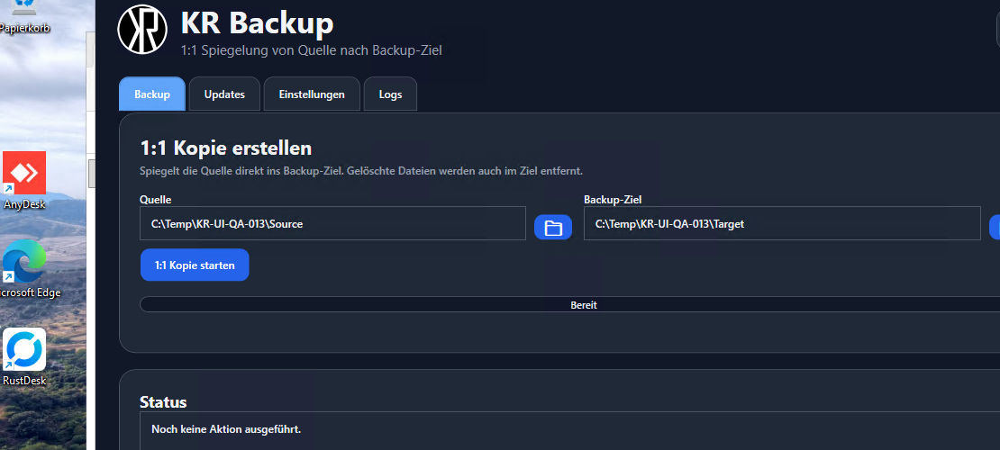
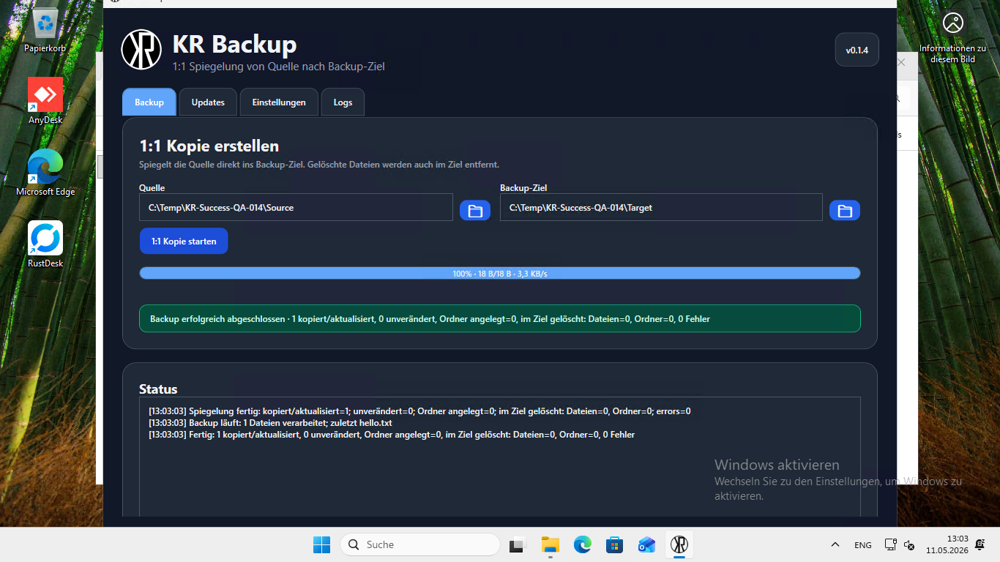
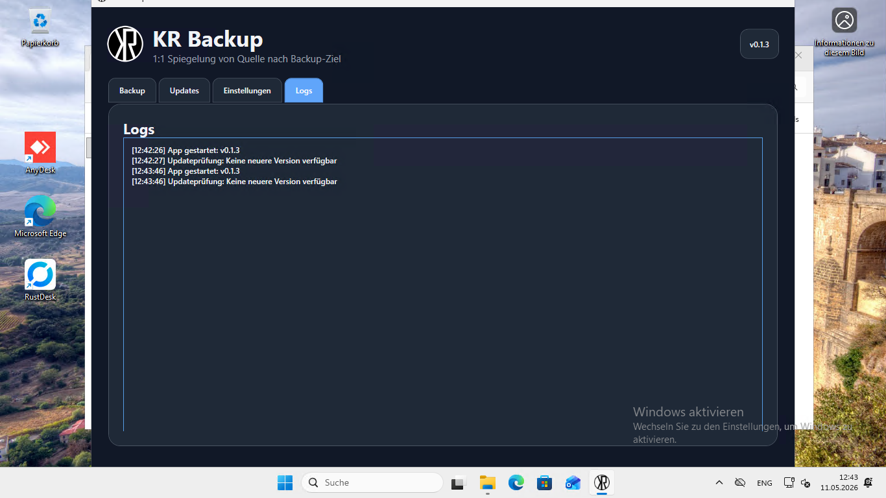
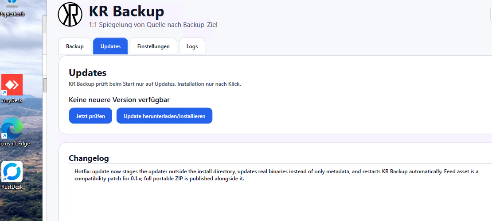
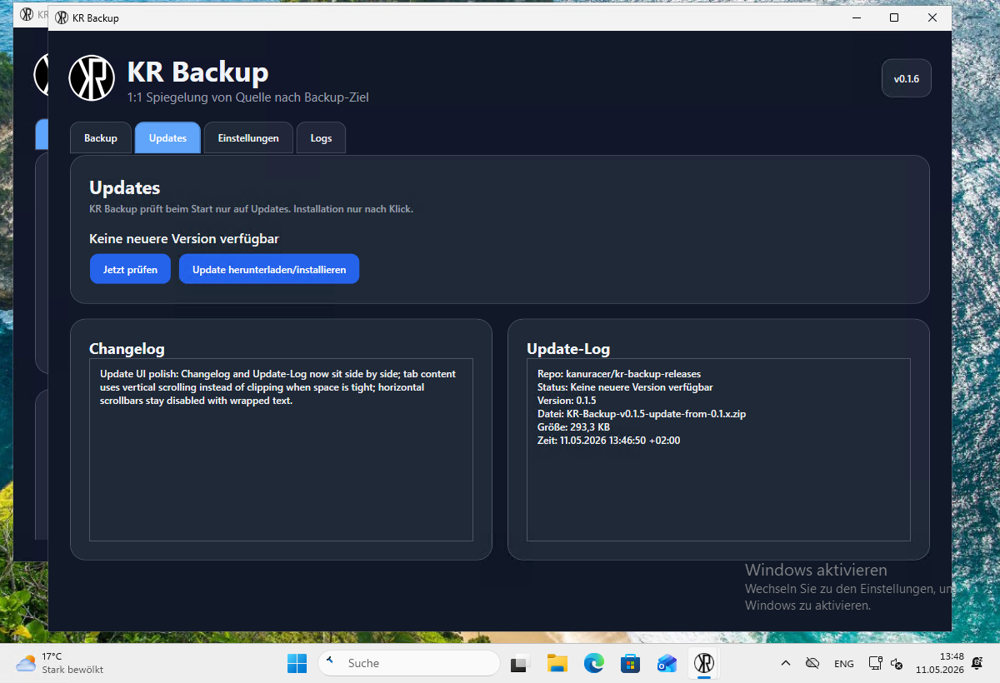

# KR Backup Releases

Public update feed for KR Backup portable Windows builds.

## Current release

- Version: `0.1.6`
- Update asset: `KR-Backup-v0.1.6-update-from-0.1.x.zip`
- Update SHA256: `d68308c691582827dc7458ffcdf87557db9093409d7a5a4235a3905961566f52`
- Full portable ZIP: `KR-Backup-v0.1.6-win-x64-portable.zip`
- Full portable SHA256: `c07ce30abb657b6891d5cdcfc2df726cc6b2163cf0718aa6e71162437e793d33`

## Update feed

`latest.json` is the machine-readable feed used by KR Backup.

```text
https://raw.githubusercontent.com/kanuracer/kr-backup-releases/main/latest.json
```

For `0.1.x`, the feed points at a small compatibility patch ZIP so the old updater can replace app binaries without touching locked runtime/updater files. The full portable ZIP is published alongside it for manual fresh installs.

------------------------------------------------------------

Download latest: [KR-Backup-v0.1.6-win-x64-portable.zip](https://raw.githubusercontent.com/kanuracer/kr-backup-releases/main/KR-Backup-v0.1.6-win-x64-portable.zip)

GitHub Release: [KR Backup v0.1.6](https://github.com/kanuracer/kr-backup-releases/releases/tag/v0.1.6)

--------------------------

# Anleitung

## Inhaltsübersicht

- [Was ist KR Backup?](#1-was-ist-kr-backup)
- [Download](#2-download)
- [ZIP entpacken](#3-zip-entpacken)
- [Programm starten](#4-programm-starten)
- [Backup einrichten](#5-backup-einrichten)
- [Backup ausführen](#6-backup-ausführen)
- [1:1-Spiegelung verstehen](#8-was-bedeutet-11-spiegelung)
- [Logs verwenden](#9-logs-verwenden)
- [Updates prüfen und installieren](#10-updates-prüfen-und-installieren)
- [Fehlerbehebung](#15-fehlerbehebung)

## 1. Was ist KR Backup?

KR Backup ist eine portable Windows-Anwendung für eine einfache **1:1-Spiegelung** von einem Quellordner in ein Backup-Ziel.

> **Wichtig:** 1:1-Spiegelung bedeutet: Wenn Dateien in der Quelle fehlen oder gelöscht wurden, werden sie auch im Backup-Ziel gelöscht. Nutze KR Backup für eine aktuelle Spiegel-Kopie, nicht als historisches Archiv.

Kurz gesagt:

- Du wählst eine **Quelle** aus, z. B. einen Spiele-/Datenordner.
- Du wählst ein **Backup-Ziel** aus, z. B. eine externe Platte oder einen anderen Ordner.
- KR Backup kopiert neue/geänderte Dateien ins Ziel.
- Dateien, die in der Quelle gelöscht wurden, werden auch im Ziel entfernt, damit das Ziel wirklich eine 1:1-Kopie bleibt.
- Fortschritt, Geschwindigkeit, Status und Logs werden in der App angezeigt.
- Updates können direkt in der App geprüft und installiert werden.



## 2. Download

1. Oben auf **Download latest** klicken.
2. Die Datei `KR-Backup-v0.1.6-win-x64-portable.zip` speichern.
3. Warten, bis der Download abgeschlossen ist.

Direktlink:

```text
https://raw.githubusercontent.com/kanuracer/kr-backup-releases/main/KR-Backup-v0.1.6-win-x64-portable.zip
```

## 3. ZIP entpacken

1. Im Download-Ordner die Datei `KR-Backup-v0.1.6-win-x64-portable.zip` suchen.
2. Rechtsklick auf die ZIP-Datei.
3. **Alle extrahieren…** auswählen.
4. Einen Zielordner wählen, z. B. `C:\Tools\KR-Backup` oder ein anderes Laufwerk.

Wichtig:

- Die App ist portabel.
- Du musst nichts installieren.
- Nicht direkt aus der ZIP starten.
- Starte die App immer aus dem entpackten Ordner.

## 4. Programm starten

1. Den entpackten Ordner öffnen.
2. `KrBackup.exe` doppelklicken.
3. Falls Windows eine Sicherheitswarnung zeigt: Quelle prüfen und nur fortfahren, wenn du dem Download vertraust.

Optional zur Hash-Prüfung der ZIP:

```powershell
Get-FileHash .\KR-Backup-v0.1.6-win-x64-portable.zip -Algorithm SHA256
```

Erwarteter SHA256:

```text
c07ce30abb657b6891d5cdcfc2df726cc6b2163cf0718aa6e71162437e793d33
```

## 5. Backup einrichten

Im Tab **Backup** gibt es zwei wichtige Felder.

### Quelle

Das ist der Ordner, der gesichert werden soll.

Beispiele:

```text
D:\MeineDaten
D:\Games\Spielstand
C:\Users\Name\Documents
```

Nutze das Ordner-Symbol neben dem Feld, um den Ordner bequem auszuwählen.

### Backup-Ziel

Das ist der Ordner, in den die 1:1-Kopie geschrieben wird.

Beispiele:

```text
E:\Backups\MeineDaten
F:\KR-Backup
X:\Backup
```

Wichtig:

- Das Backup-Ziel darf nicht identisch mit der Quelle sein.
- Das Backup-Ziel sollte nicht innerhalb der Quelle liegen.
- Nutze am besten ein anderes Laufwerk oder eine externe Platte.

## 6. Backup ausführen

1. Quelle prüfen.
2. Backup-Ziel prüfen.
3. Auf **1:1 Kopie starten** klicken.
4. Warten, bis die Fortschrittsanzeige fertig ist.
5. Nach erfolgreichem Abschluss erscheint eine grüne Erfolgsmeldung.



Die Erfolgsmeldung zeigt zusammengefasst:

- kopierte/aktualisierte Dateien
- unveränderte Dateien
- angelegte Ordner
- gelöschte Dateien/Ordner im Ziel
- Fehleranzahl

## 7. Während des Backups

Während KR Backup arbeitet, siehst du:

- Fortschrittsbalken
- Prozentanzeige
- aktuelle Datei oder Statusdetails
- Geschwindigkeit/Transferinformationen, wenn verfügbar
- laufende Statusmeldungen

Du solltest die App während des Backups nicht schließen.

## 8. Was bedeutet 1:1-Spiegelung?

1:1-Spiegelung bedeutet:

- Alles, was in der Quelle vorhanden ist, soll im Ziel vorhanden sein.
- Alles, was in der Quelle nicht mehr vorhanden ist, soll im Ziel ebenfalls entfernt werden.

| Aktion in Quelle | Ergebnis im Backup-Ziel |
|---|---|
| Neue Datei erstellt | Datei wird kopiert |
| Datei geändert | Datei wird aktualisiert |
| Datei unverändert | Datei wird übersprungen |
| Datei gelöscht | Datei wird im Ziel gelöscht |
| Ordner gelöscht | Ordner wird im Ziel gelöscht, wenn leer/nicht mehr nötig |

Das Ziel ist also eine aktuelle Kopie, keine historische Archivsammlung.

## 9. Logs verwenden

KR Backup schreibt Logs persistent in den App-Ordner. Im Tab **Logs** kannst du alte und neue Einträge einsehen.



Typische Logeinträge:

- Start der App
- gewählte Pfade
- Backup-Fortschritt
- Zusammenfassung
- Fehler
- Update-Prüfung
- Update-Installation

Wenn du ein Problem meldest, sind Screenshots vom Logs-Tab sehr hilfreich.

## 10. Updates prüfen und installieren

Im Tab **Updates** kannst du prüfen, ob eine neue Version verfügbar ist.



Vorgehen:

1. Tab **Updates** öffnen.
2. Auf **Jetzt prüfen** klicken.
3. Changelog lesen.
4. Wenn eine neue Version verfügbar ist, auf **Update herunterladen/installieren** klicken.
5. KR Backup lädt das Update-Paket herunter.
6. Die App schließt sich kurz.
7. Der Updater installiert die neue Version.
8. KR Backup startet danach automatisch wieder.

Der Updates-Tab zeigt:

- ob eine neue Version verfügbar ist
- Changelog / Release Notes aus `latest.json`
- Update-Log mit technischen Details



## 11. Manuell aktualisieren

Falls das automatische Update nicht genutzt werden soll:

1. Neueste Full portable ZIP herunterladen.
2. KR Backup schließen.
3. Bestehenden KR-Backup-Ordner sichern oder umbenennen.
4. Neue ZIP entpacken.
5. Falls du bestehende Einstellungen/Logs behalten willst, den `data`-Ordner aus der alten Version in den neuen Ordner kopieren.
6. Neue `KrBackup.exe` starten.
7. Version oben rechts prüfen.

## 12. Einstellungen und Theme

Im Tab **Einstellungen** kannst du die Darstellung ändern, z. B. Hell/Dunkel.

Hinweise:

- Einstellungen werden portabel im App-Ordner unter `data` gespeichert.
- Wenn du den App-Ordner verschiebst, nimm den `data`-Ordner mit.
- Das dunkle Theme nutzt passende Farben für Buttons, Scrollbars und Textkontrast.

## 13. Ordnerstruktur nach dem Entpacken

Typisch sieht der Ordner so aus:

```text
KR-Backup\
  KrBackup.exe
  KrBackup.dll
  KrBackup.Core.dll
  KrBackup.Updater.exe
  appsettings.json
  data\
    settings.json
    logs\
      app.log
```

Der `data`-Ordner enthält deine lokalen Einstellungen und Logs.

## 14. Sicherheit und gute Praxis

Empfehlungen:

- Backup-Ziel regelmäßig kontrollieren.
- Erst mit einem kleinen Testordner ausprobieren.
- Bei wichtigen Daten zusätzlich ein unabhängiges Backup behalten.
- Externe Backup-Platte nach dem Backup sicher entfernen.
- ZIP-Datei und Hash prüfen, wenn du ganz sicher gehen willst.
- App nur aus vertrauenswürdiger Quelle herunterladen.

## 15. Fehlerbehebung

### App startet nicht

- Prüfen, ob die ZIP vollständig entpackt wurde.
- Nicht direkt aus der ZIP starten.
- `KrBackup.exe` aus dem entpackten Ordner starten.
- Windows-Sicherheitswarnungen prüfen.

### Backup startet nicht

- Quelle existiert?
- Backup-Ziel existiert oder kann erstellt werden?
- Genug Speicherplatz vorhanden?
- Quelle und Ziel sind nicht identisch?
- Ziel liegt nicht innerhalb der Quelle?

### Dateien werden im Ziel gelöscht

Das ist bei 1:1-Spiegelung normal, wenn diese Dateien in der Quelle nicht mehr vorhanden sind.

Wenn du gelöschte Dateien historisch behalten willst, brauchst du zusätzlich ein Archiv-/Snapshot-Backup. KR Backup spiegelt den aktuellen Stand.

### Update klappt nicht

- App schließen und erneut starten.
- Updates-Tab öffnen und erneut prüfen.
- Falls nötig manuell aktualisieren: neue Full portable ZIP herunterladen und entpacken.
- `data`-Ordner übernehmen, wenn Einstellungen/Logs erhalten bleiben sollen.

### Logs prüfen

- Tab **Logs** öffnen.
- Letzte Fehlermeldungen suchen.
- Bei Supportanfragen Screenshot oder Inhalt der relevanten Logzeilen mitschicken.

## 16. Für technische Nutzer

### Update Feed

```text
https://raw.githubusercontent.com/kanuracer/kr-backup-releases/main/latest.json
```

`latest.json` ist der maschinenlesbare Feed für die Updateprüfung.

### Warum gibt es zwei ZIPs?

- Full portable ZIP: komplette App für Download/Neuinstallation.
- Update ZIP: kleines Paket für den eingebauten Updater.

Als Nutzer brauchst du normalerweise nur die Full portable ZIP oder den Update-Button in der App.

### Hash-Prüfung der ZIP

```powershell
Get-FileHash .\KR-Backup-v0.1.6-win-x64-portable.zip -Algorithm SHA256
```

Erwarteter SHA256:

```text
c07ce30abb657b6891d5cdcfc2df726cc6b2163cf0718aa6e71162437e793d33
```

## 17. Kurzfassung

1. Full portable ZIP herunterladen.
2. ZIP entpacken.
3. `KrBackup.exe` starten.
4. Quelle wählen.
5. Backup-Ziel wählen.
6. **1:1 Kopie starten** klicken.
7. Erfolgsmeldung und Logs prüfen.
8. Updates über den Updates-Tab installieren.
